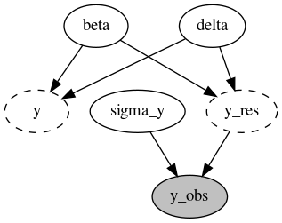
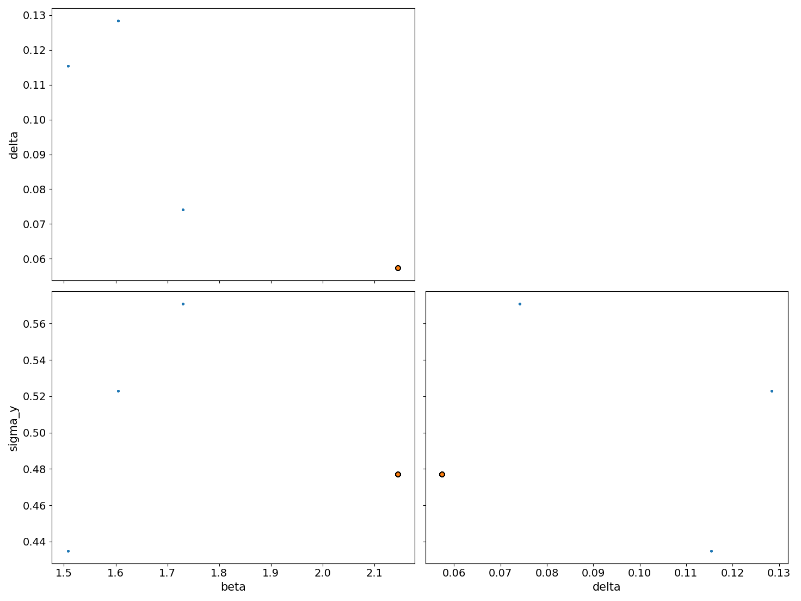
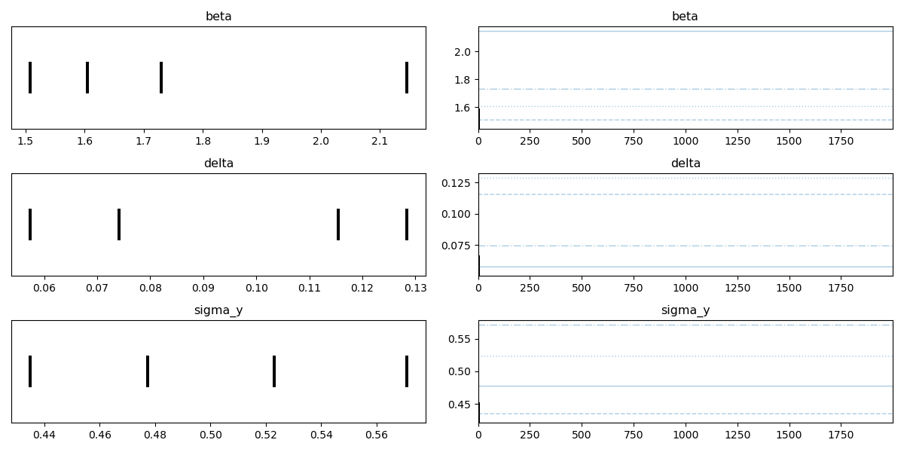

Report(case_study=120_hpf/Basic/BK, scenario=ENSDARG00000000002)
================================================================

+ Using `120_hpf/Basic/BK==None`
+ Using `pymob==0.5.20`
+ Using backend: `NumpyroBackend`
+ Using settings: `case_studies/120_hpf/Basic/BK/scenarios/ENSDARG00000000002/settings.cfg`

## Report: Model ✓

### Model

```python
def basic_1s(t, M0, beta, delta):
    '''
    beta: transcription rate
    delta:  degradation rate
    '''
    return M0 * jnp.exp(-delta * t) + beta/delta * (1 - jnp.exp(-delta * t))

```

### Probability model



## Report: Parameters ✓

### $x_{in}$

No model input

### $y_0$

No starting values

### Free parameters


+ beta $\sim$ lognorm(scale=1.3359683433333336,s=1.0,dims=())
+ delta $\sim$ lognorm(scale=0.1,s=1.0,dims=())
+ sigma_y $\sim$ lognorm(scale=0.5,s=0.5,dims=())


### Fixed parameters


+ M0 $=$ nan, dims=()


## Report: Table parameter estimates ✓

|    | index   | mean ± std      |
|---:|:--------|:----------------|
|  0 | beta    | 1.75 ± 0.243    |
|  1 | delta   | 0.0939 ± 0.0291 |
|  2 | sigma_y | 0.502 ± 0.0508  |

## Report: Goodness of fit ✓

|                                 |   y |     model |
|:--------------------------------|----:|----------:|
| NRMSE                           |   0 | nan       |
| NRMSE (95%-hdi[lower])          |   0 | nan       |
| NRMSE (95%-hdi[upper])          |   0 | nan       |
| Log-Likelihood                  |   0 |   0       |
| Log-Likelihood (95%-hdi[lower]) |   0 |   0       |
| Log-Likelihood (95%-hdi[upper]) |   0 |   0       |
| n (data)                        |  28 |  28       |
| k (parameters)                  | nan |   3       |
| BIC                             | nan |   9.99661 |
| BIC (95%-hdi[lower])            | nan |   9.99661 |
| BIC (95%-hdi[upper])            | nan |   9.99661 |

Report 'goodness_of_fit' was successfully generated and saved in './results/120_hpf/Basic/BK/ENSDARG00000000002/goodness_of_fit.csv'

## Report: Diagnostics ✓





Report 'diagnostics' was successfully generated and saved in '('./results/120_hpf/Basic/BK/ENSDARG00000000002/posterior_pairs.png', './results/120_hpf/Basic/BK/ENSDARG00000000002/posterior_trace.png')'

