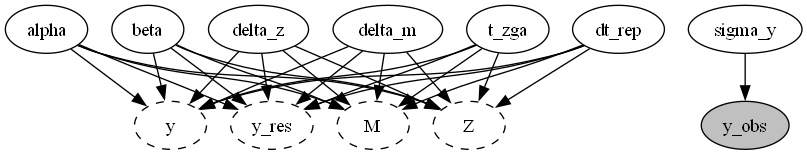
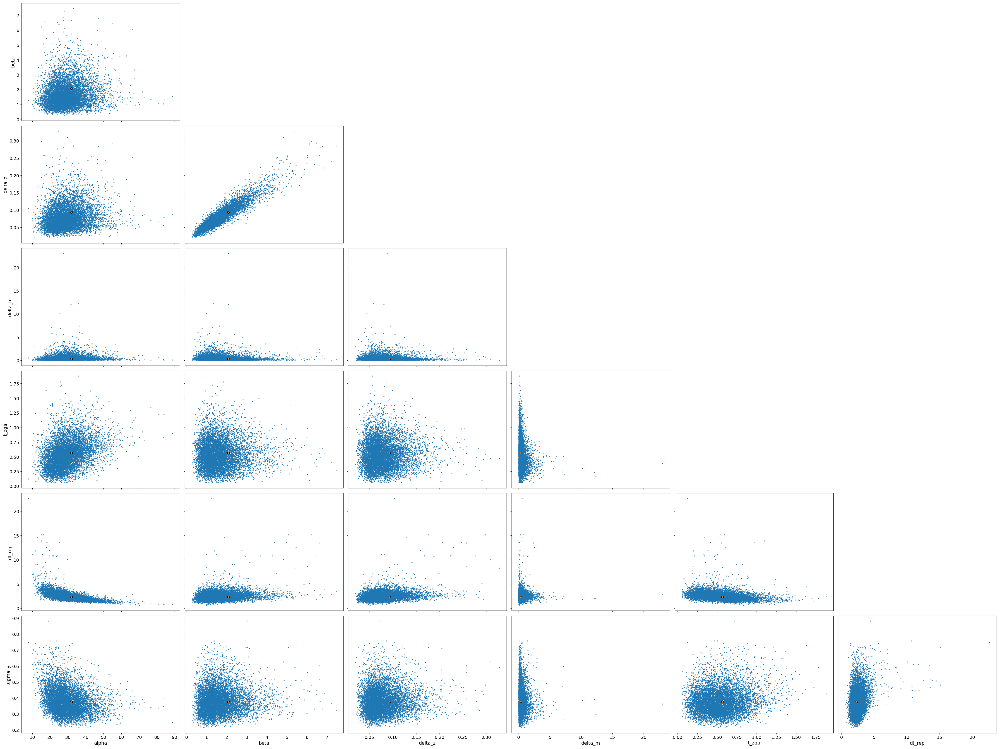
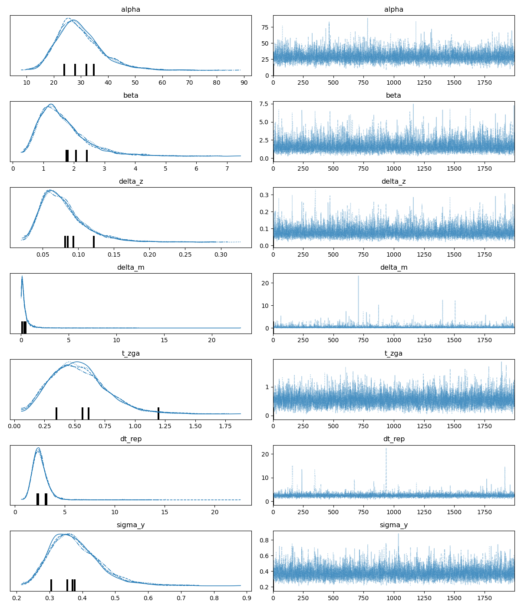

Report(case_study=Repression_M_nuts_120, scenario=ENSDARG00000000018)
=====================================================================

+ Using `Repression_M_nuts_120==None`
+ Using `pymob==0.6.3`
+ Using backend: `NumpyroBackend`
+ Using settings: `case_studies\Repression_M_nuts_120\scenarios\ENSDARG00000000018\settings.cfg`

## Report: Model ✓

### Model

```python
    @staticmethod
    def _rhs_jax(t, y, alpha, beta, delta_z, delta_m, t_zga, dt_rep, s):

        M, Z = y

        dM_dt = - delta_m * M

        t_rep = t_zga + dt_rep
        on = jax.nn.sigmoid(s * (t - t_zga))
        off =  jax.nn.sigmoid(s * (t - t_rep))

        beta_on = alpha * on * (1 - off) + beta * off
        dZ_dt = beta_on - delta_z * Z

        return dM_dt, dZ_dt

```

### Solver post processing

```python
    @staticmethod
    def _solver_post_processing(results, time, interpolation):
        results["y"] = results["M"] + results["Z"]
        return results

```

### Probability model



## Report: Parameters ✓

### $x_{in}$

No model input

### $y_0$

|    |       0 |
|:---|--------:|
| M  | 6.55641 |
| Z  | 0       |

### Free parameters


+ alpha $\sim$ lognorm(scale=11.57115941,s=0.5,dims=())
+ beta $\sim$ lognorm(scale=1.6431127433333332,s=0.5,dims=())
+ delta_z $\sim$ lognorm(scale=0.1,s=1.0,dims=())
+ delta_m $\sim$ lognorm(scale=0.35,s=1.0,dims=())
+ t_zga $\sim$ lognorm(scale=3.0,s=1.0,dims=())
+ dt_rep $\sim$ lognorm(scale=6.0,s=1.0,dims=())
+ sigma_y $\sim$ lognorm(scale=0.5,s=0.5,dims=())


### Fixed parameters


+ s $=$ 5, dims=()


## Report: Table parameter estimates ✓

|    | index   | mean ± std     |
|---:|:--------|:---------------|
|  0 | alpha   | 29.5 ± 8.27    |
|  1 | beta    | 1.64 ± 0.81    |
|  2 | delta_z | 0.079 ± 0.0326 |
|  3 | delta_m | 0.423 ± 0.609  |
|  4 | t_zga   | 0.537 ± 0.23   |
|  5 | dt_rep  | 2.53 ± 0.908   |
|  6 | sigma_y | 0.379 ± 0.0771 |

## Report: Goodness of fit ✓

|                                 |          y |     model |
|:--------------------------------|-----------:|----------:|
| NRMSE                           |   0.233807 | nan       |
| NRMSE (95%-hdi[lower])          |   0.128889 | nan       |
| NRMSE (95%-hdi[upper])          |   0.35345  | nan       |
| Log-Likelihood                  |  -7.21465  |  -7.21465 |
| Log-Likelihood (95%-hdi[lower]) | -11.493    | -11.493   |
| Log-Likelihood (95%-hdi[upper]) |  -3.92304  |  -3.92304 |
| n (data)                        |  18        |  18       |
| k (parameters)                  | nan        |   7       |
| BIC                             | nan        |  34.6619  |
| BIC (95%-hdi[lower])            | nan        |  28.0787  |
| BIC (95%-hdi[upper])            | nan        |  43.2186  |

Report 'goodness_of_fit' was successfully generated and saved in 'results\Repression_M_nuts_120\ENSDARG00000000018/goodness_of_fit.csv'

## Report: Diagnostics ✓





Report 'diagnostics' was successfully generated and saved in '('results\\Repression_M_nuts_120\\ENSDARG00000000018\\posterior_pairs.png', 'results\\Repression_M_nuts_120\\ENSDARG00000000018\\posterior_trace.png')'

