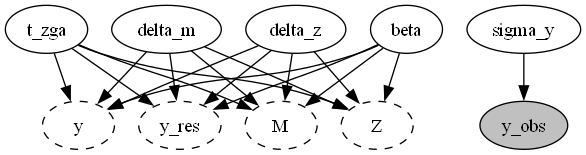
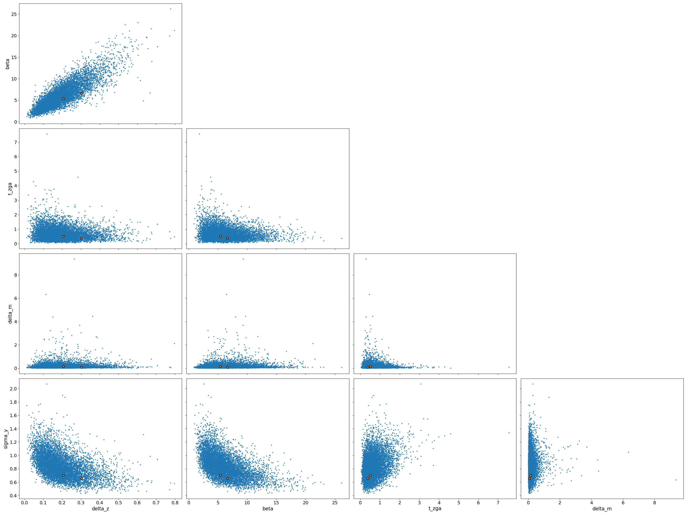
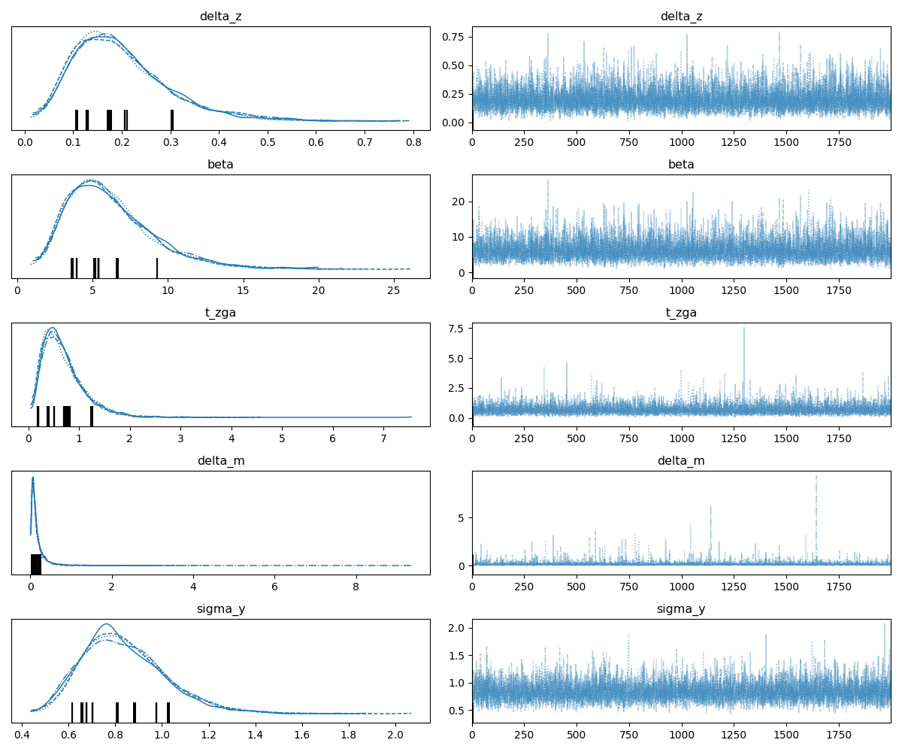

Report(case_study=ZGA_M_nuts_120, scenario=ENSDARG00000000018)
==============================================================

+ Using `ZGA_M_nuts_120==None`
+ Using `pymob==0.6.3`
+ Using backend: `NumpyroBackend`
+ Using settings: `case_studies\ZGA_M_nuts_120\scenarios\ENSDARG00000000018\settings.cfg`

## Report: Model ✓

### Model

```python
    @staticmethod
    def _rhs_jax(t, y, beta, delta_z, delta_m, t_zga, s):

        M, Z = y

        dM_dt = - delta_m * M
        on = jax.nn.sigmoid(s * (t - t_zga))
        dZ_dt = beta * on - delta_z * Z
        
        return dM_dt, dZ_dt

```

### Solver post processing

```python
    @staticmethod
    def _solver_post_processing(results, time, interpolation):
        # add total transcript = maternal + zygotic
        results["y"] = results["M"] + results["Z"]
        return results

```

### Probability model



## Report: Parameters ✓

### $x_{in}$

No model input

### $y_0$

|    |       0 |
|:---|--------:|
| M  | 6.55641 |
| Z  | 0       |

### Free parameters


+ delta_z $\sim$ lognorm(scale=0.1,s=1.0,dims=())
+ beta $\sim$ lognorm(scale=1.6431127433333332,s=0.5,dims=())
+ t_zga $\sim$ lognorm(scale=3.0,s=1.0,dims=())
+ delta_m $\sim$ lognorm(scale=0.35,s=1.0,dims=())
+ sigma_y $\sim$ lognorm(scale=0.5,s=0.5,dims=())


### Fixed parameters


+ s $=$ 5, dims=()


## Report: Table parameter estimates ✓

|    | index   | mean ± std     |
|---:|:--------|:---------------|
|  0 | delta_z | 0.198 ± 0.0983 |
|  1 | beta    | 6.21 ± 2.91    |
|  2 | t_zga   | 0.688 ± 0.428  |
|  3 | delta_m | 0.175 ± 0.264  |
|  4 | sigma_y | 0.839 ± 0.18   |

## Report: Goodness of fit ✓

|                                 |          y |    model |
|:--------------------------------|-----------:|---------:|
| NRMSE                           |   0.485838 | nan      |
| NRMSE (95%-hdi[lower])          |   0.237408 | nan      |
| NRMSE (95%-hdi[upper])          |   0.929692 | nan      |
| Log-Likelihood                  | -22.9044   | -22.9044 |
| Log-Likelihood (95%-hdi[lower]) | -28.5032   | -28.5032 |
| Log-Likelihood (95%-hdi[upper]) | -17.4517   | -17.4517 |
| n (data)                        |  18        |  18      |
| k (parameters)                  | nan        |   5      |
| BIC                             | nan        |  60.2605 |
| BIC (95%-hdi[lower])            | nan        |  49.3553 |
| BIC (95%-hdi[upper])            | nan        |  71.4582 |

Report 'goodness_of_fit' was successfully generated and saved in 'results\ZGA_M_nuts_120\ENSDARG00000000018/goodness_of_fit.csv'

## Report: Diagnostics ✓





Report 'diagnostics' was successfully generated and saved in '('results\\ZGA_M_nuts_120\\ENSDARG00000000018\\posterior_pairs.png', 'results\\ZGA_M_nuts_120\\ENSDARG00000000018\\posterior_trace.png')'

