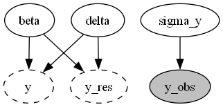
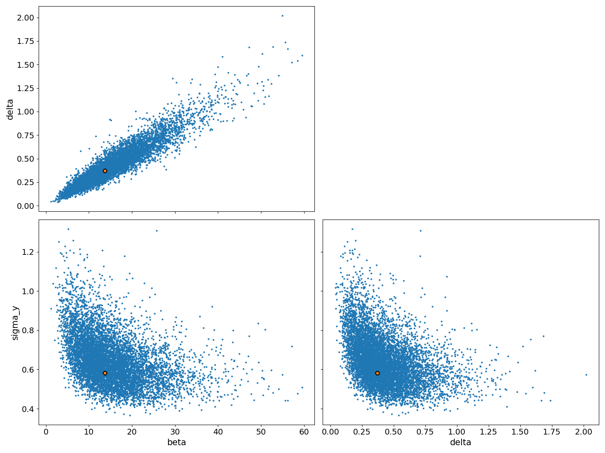
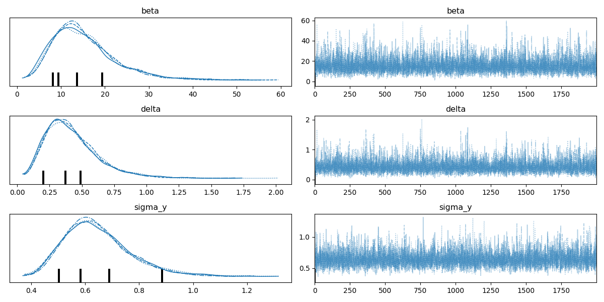

Report(case_study=basic_1s_nuts_120, scenario=ENSDARG00000000018)
=================================================================

+ Using `basic_1s_nuts_120==None`
+ Using `pymob==0.6.3`
+ Using backend: `NumpyroBackend`
+ Using settings: `case_studies\basic_1s_nuts_120\scenarios\ENSDARG00000000018\settings.cfg`

## Report: Model ✓

### Model

```python
def basic_1s(t, M0, beta, delta):
    '''
    beta: transcription rate
    delta:  degradation rate
    '''
    return M0 * jnp.exp(-delta * t) + beta/delta * (1 - jnp.exp(-delta * t))

```

### Probability model



## Report: Parameters ✓

### $x_{in}$

No model input

### $y_0$

No starting values

### Free parameters


+ beta $\sim$ lognorm(scale=1.6431127433333332,s=1.0,dims=())
+ delta $\sim$ lognorm(scale=0.1,s=1.0,dims=())
+ sigma_y $\sim$ lognorm(scale=0.5,s=0.5,dims=())


### Fixed parameters


+ M0 $=$ 6.5564108, dims=()


## Report: Table parameter estimates ✓

|    | index   | mean ± std    |
|---:|:--------|:--------------|
|  0 | beta    | 15.3 ± 7.31   |
|  1 | delta   | 0.426 ± 0.211 |
|  2 | sigma_y | 0.646 ± 0.124 |

## Report: Goodness of fit ✓

|                                 |          y |    model |
|:--------------------------------|-----------:|---------:|
| NRMSE                           |   0.392822 | nan      |
| NRMSE (95%-hdi[lower])          |   0.214252 | nan      |
| NRMSE (95%-hdi[upper])          |   0.656284 | nan      |
| Log-Likelihood                  | -17.8767   | -17.8767 |
| Log-Likelihood (95%-hdi[lower]) | -21.8929   | -21.8929 |
| Log-Likelihood (95%-hdi[upper]) | -14.7095   | -14.7095 |
| n (data)                        |  18        |  18      |
| k (parameters)                  | nan        |   3      |
| BIC                             | nan        |  44.4245 |
| BIC (95%-hdi[lower])            | nan        |  38.0901 |
| BIC (95%-hdi[upper])            | nan        |  52.457  |

Report 'goodness_of_fit' was successfully generated and saved in 'results\basic_1s_nuts_120\ENSDARG00000000018/goodness_of_fit.csv'

## Report: Diagnostics ✓





Report 'diagnostics' was successfully generated and saved in '('results\\basic_1s_nuts_120\\ENSDARG00000000018\\posterior_pairs.png', 'results\\basic_1s_nuts_120\\ENSDARG00000000018\\posterior_trace.png')'

